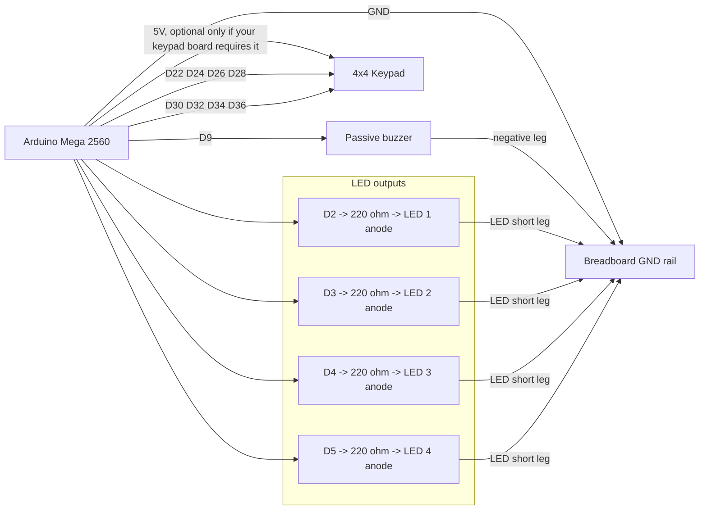

# Wiring Diagram

This layout targets an Arduino Mega 2560, a 4x4 membrane keypad, four LEDs, four 220 ohm resistors, and an optional passive buzzer.

Open [wiring.svg](wiring.svg) for a visual breadboard-style reference while you build.

## Pin Map

| Part | Arduino pin | Breadboard connection |
| --- | --- | --- |
| LED 1 anode | D2 | LED 1 long leg through 220 ohm resistor |
| LED 2 anode | D3 | LED 2 long leg through 220 ohm resistor |
| LED 3 anode | D4 | LED 3 long leg through 220 ohm resistor |
| LED 4 anode | D5 | LED 4 long leg through 220 ohm resistor |
| LED cathodes | GND | Short legs to ground rail |
| Buzzer + | D9 | Positive buzzer leg |
| Buzzer - | GND | Negative buzzer leg |
| Keypad R1 | D22 | Keypad row 1 |
| Keypad R2 | D24 | Keypad row 2 |
| Keypad R3 | D26 | Keypad row 3 |
| Keypad R4 | D28 | Keypad row 4 |
| Keypad C1 | D30 | Keypad column 1 |
| Keypad C2 | D32 | Keypad column 2 |
| Keypad C3 | D34 | Keypad column 3 |
| Keypad C4 | D36 | Keypad column 4 |

## Breadboard View

## Physical Build Order

1. Put each LED across the breadboard center gap so the legs are not in the same row.
2. Connect each LED short leg to the ground rail.
3. Connect each LED long leg to a 220 ohm resistor, then from the resistor to D2, D3, D4, and D5.
4. Connect the buzzer positive leg to D9 and the negative leg to the ground rail.
5. Connect the keypad eight-pin ribbon to D22, D24, D26, D28, D30, D32, D34, and D36 in row-then-column order.
6. Connect Arduino GND to the breadboard ground rail.

If the keypad buttons seem scrambled, keep the code the same and swap the row/column pin order in `rowPins` and `colPins` until pressing `1`, `2`, `3`, `A` matches the first row.
