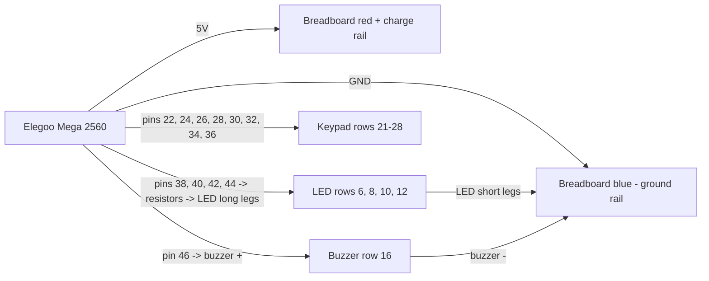

# Wiring Diagram

This layout targets the Elegoo Mega 2560 controller board, a full-size breadboard, a 4x4 membrane keypad, four LEDs, four 220 ohm resistors, and an optional passive buzzer.

Open [wiring.svg](wiring.svg) for a visual breadboard reference while you build.

## Board Labels

The Elegoo Mega board labels the digital header pins as plain numbers. This build uses only the `22`-`53` digital-pin block for signal wires. In this guide, `22`, `24`, `26`, `28`, `30`, `32`, `34`, `36`, `38`, `40`, `42`, `44`, and `46` mean those exact numbered Mega pins.

`GND` means a ground pin. `5V` means the 5 volt power pin, used here as the red breadboard charge rail.

## Breadboard Coordinate Plan

Use the breadboard row numbers printed on the side. Put the LED legs across the center gap so the anode and cathode are not connected to each other.

| Breadboard point | Connects to | Purpose |
| --- | --- | --- |
| Red `+` rail | Mega `5V` | Charge rail, available for modules that need 5V |
| Blue `-` rail | Mega `GND` | Shared ground rail |
| Row `6a` | Mega pin `38` through a 220 ohm resistor | LED 1 signal |
| Row `6f` | LED 1 long leg | LED 1 anode |
| Row `6j` | Blue `-` rail | LED 1 short leg to ground |
| Row `8a` | Mega pin `40` through a 220 ohm resistor | LED 2 signal |
| Row `8f` | LED 2 long leg | LED 2 anode |
| Row `8j` | Blue `-` rail | LED 2 short leg to ground |
| Row `10a` | Mega pin `42` through a 220 ohm resistor | LED 3 signal |
| Row `10f` | LED 3 long leg | LED 3 anode |
| Row `10j` | Blue `-` rail | LED 3 short leg to ground |
| Row `12a` | Mega pin `44` through a 220 ohm resistor | LED 4 signal |
| Row `12f` | LED 4 long leg | LED 4 anode |
| Row `12j` | Blue `-` rail | LED 4 short leg to ground |
| Row `16a` | Mega pin `46` | Buzzer positive leg |
| Row `16j` | Blue `-` rail | Buzzer negative leg |

## Keypad Wire Order

Most 4x4 membrane keypads have 8 pins on the ribbon cable. Hold the keypad facing you with the ribbon pins pointing down. Number the ribbon wires from left to right as `1` through `8`.

Land the keypad ribbon on breadboard rows `21` through `28`, then run jumpers from those rows to the Mega:

| Keypad wire | Breadboard row | Mega pin | Code meaning |
| --- | --- | --- | --- |
| Wire `1` | `21e` | `22` | Row 1 |
| Wire `2` | `22e` | `24` | Row 2 |
| Wire `3` | `23e` | `26` | Row 3 |
| Wire `4` | `24e` | `28` | Row 4 |
| Wire `5` | `25e` | `30` | Column 1 |
| Wire `6` | `26e` | `32` | Column 2 |
| Wire `7` | `27e` | `34` | Column 3 |
| Wire `8` | `28e` | `36` | Column 4 |

The keypad is a switch matrix, so it does not use the red `+` charge rail or the blue `-` ground rail in this build. It only needs the 8 signal wires above.

## Flow Summary

## Physical Build Order

1. Connect Mega `5V` to the breadboard red `+` rail.
2. Connect Mega `GND` to the breadboard blue `-` rail.
3. Put LED 1 on row `6`, LED 2 on row `8`, LED 3 on row `10`, and LED 4 on row `12`.
4. Connect each LED short leg to the blue `-` ground rail.
5. Connect Mega pins `38`, `40`, `42`, and `44` to the matching LED rows through 220 ohm resistors.
6. Put the buzzer on row `16`; connect buzzer `+` to Mega pin `46` and buzzer `-` to the blue `-` rail.
7. Put keypad wires `1` through `8` on breadboard rows `21` through `28`.
8. Connect rows `21` through `28` to Mega pins `22`, `24`, `26`, `28`, `30`, `32`, `34`, and `36` in that order.

If the keypad buttons seem scrambled, keep the wiring neat and swap the `rowPins` or `colPins` order in `LightRecorderGame.ino` until pressing `1`, `2`, `3`, `A` matches the first row.
